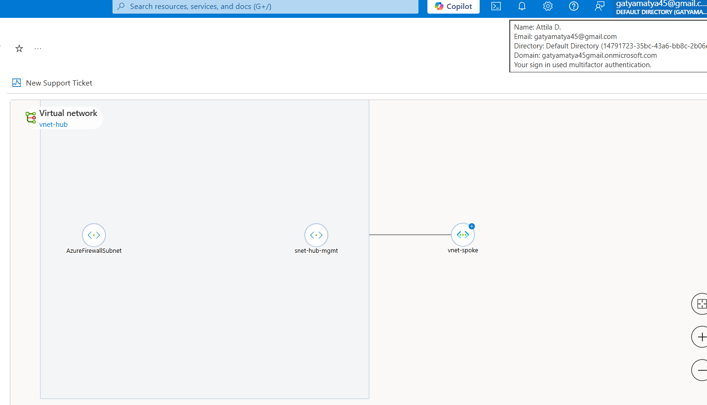
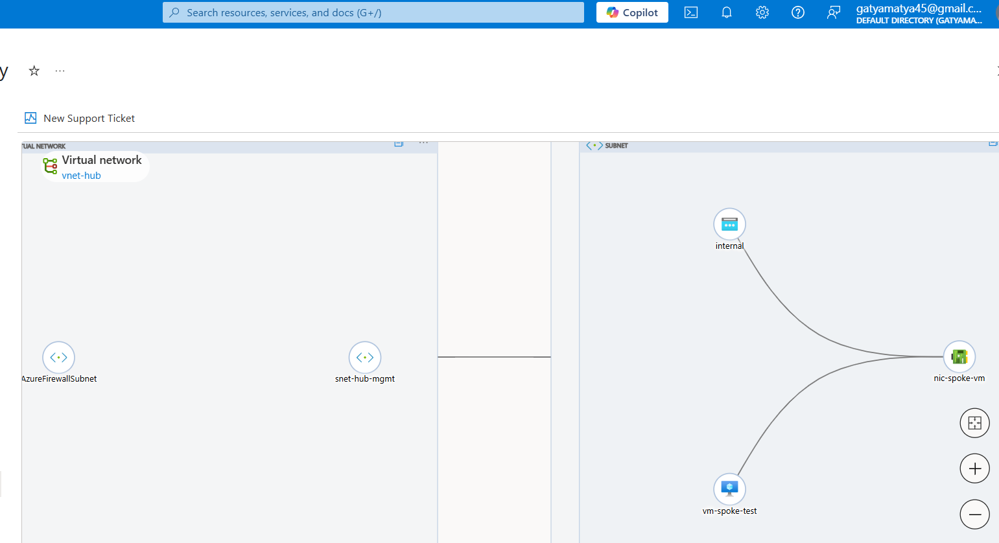
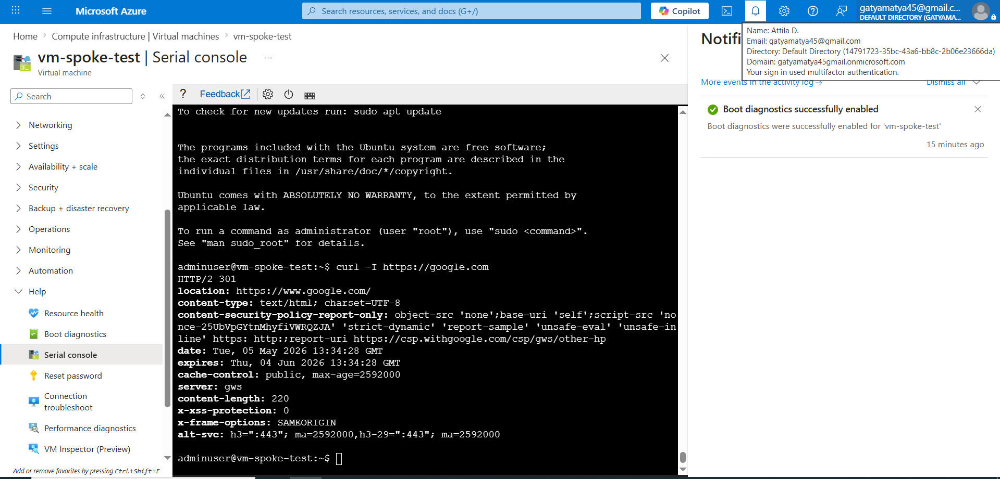

Secure Automated Azure Hub-and-Spoke Infrastructure with Terraform

Project Overview:
This project demonstrates a production-ready, secure Hub-and-Spoke network topology in Microsoft Azure, deployed entirely via Terraform (Infrastructure as Code). The architecture centralizes security functions and ensures private, high-speed connectivity between resources.

Architecture Features:
- Hub-and-Spoke Topology: Isolated Hub VNet for shared services and Spoke VNet for workloads, connected via VNet Peering.
- Centralized Security: Implemented Azure Firewall with strict Application Rules for traffic filtering.
- Forced Tunneling (UDR): Custom Route Tables (User Defined Routes) to ensure all outbound Spoke traffic is inspected by the Firewall.
- PaaS Protection: Private Endpoints and Private DNS Zones used to access Azure Storage, completely bypassing the public internet.

Technical Challenges & Troubleshooting (The Learning Process):
During the deployment, several real world infrastructure issues were identified and resolved:

1. IP Address Overlap (CidrBlockConflict):
- Issue: The initial "AzureFirewallSubnet" address range overlapped with existing subnets in the Hub VNet.
- Solution: Performed network address planning and reassigned the firewall to a non-overlapping range ("10.0.100.0/26").
- Lesson: Importance of precise IP Address Management (IPAM) in cloud networking.

 2. DNS Resolution Ambiguity:
- Issue: Initially, the Storage Account resolved to a public IP address despite having a Private Endpoint.
- Solution: Integrated an "Azure Private DNS Zone" and linked it to the Spoke VNet.
- Outcome: Successful resolution to a private IP ("10.1.1.5"), ensuring zero exposure to the public web.

3. SKU Availability Constraints:
- Issue: Specific VM sizes (B1s, B2s) were unavailable in the selected(my) region (West Europe).
- Solution: Dynamically adjusted the Terraform configuration to a different SKU ("Standard_D2s_v3") to ensure deployment continuity.

Evidence and Validation:

1. Network Topology

Visual representation of the Hub-and-Spoke structure and peering.

2. Firewall Validation (Allowed vs. Blocked)

Proof of the "Strict Filtering" policy. Google is accessible, while unauthorized sites (Facebook) are blocked.

### 3. Private Link Verification

*The `host` command confirms that the Storage Account is accessed via a private internal IP (10.1.1.5).*

 Tech Stack:
- IaC: Terraform
- Cloud: Microsoft Azure
- Networking: Azure Firewall, UDR, VNet Peering, Private Link
- OS: Ubuntu Linux (Test Workload)
